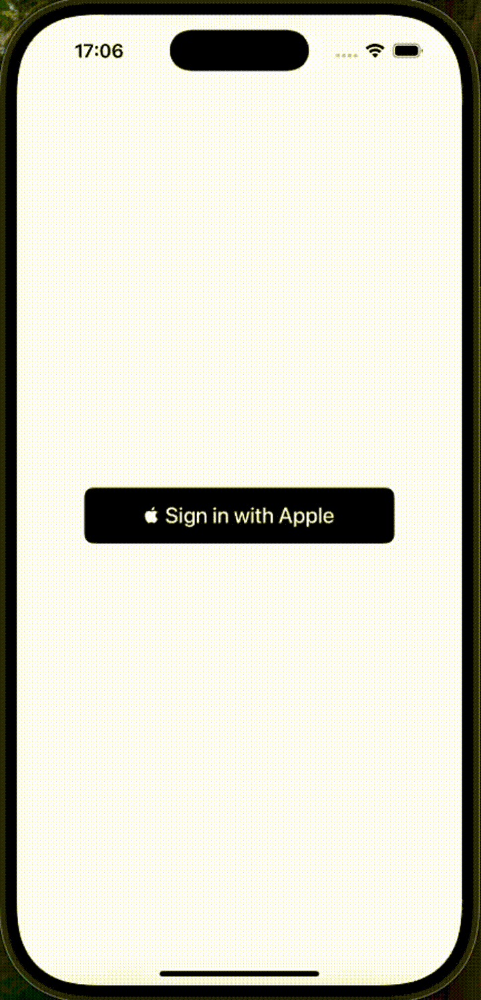

# Apple Sign in iOs Client-Server app
Sample iOS project demonstrating how to implement Apple Sign-in in a Client (iOS) - Server (Dokerized Node.JS) app . This is the basecode for following post [Seamless Apple Sign-In for iOS Apps with a Node.js Backend](https://javios.eu/uncategorized/seamless-apple-sign-in-for-ios/)

## iOs App Review

## Requirements

- **Xcode 15.0 or later**
- **iOS 16.0 or later**
